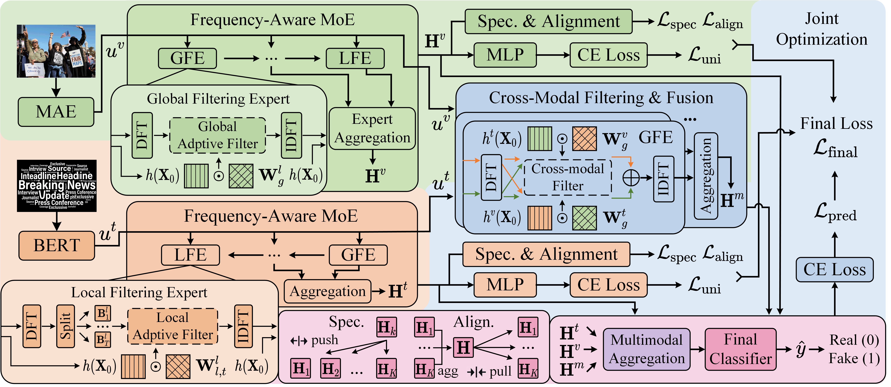

# Modality Filtering and Fusion: A Frequency-Aware Heterogeneous Mixture-of-Experts for Fake News Detection
This is the code for our paper Modality Filtering and Fusion: A ***F***requency-Aware ***H***eterogeneous ***M***ixture-of-***EX***perts for Fake News Detection (FHMEX).


## Requirements
We use the following environment:
* Python 3.12.12
* Pytorch 2.9.0
* numpy 1.26.4
* tqdm 4.67.1 
## Datasets
Weibo, Weibo-21 and Twitter datasets are used for experiments, which can be found in the following links:
* Weibo: https://github.com/yliuaa/MIMoE-FND
* Weibo-21: https://github.com/yliuaa/MIMoE-FND
* Twitter: https://github.com/wangbing1416/DAEDCMD
## Quick Start
You can run FMMEX with the following code or use the script run.sh. Training logs are provided in ./log for reproduce.
```
runFHMEX.py --dataset weibo21 --epoch_num 50 --n_layers 2
runFHMEX.py --dataset weibo --epoch_num 50 --n_layers 1
runFHMEX.py --dataset twitter --epoch_num 50 --n_layers 2
```


